# FraudSentinel 🔍


> AI-powered carrier fraud investigation platform built with Spring Boot, React and MongoDB.

## 🚀 Quick Links

🌐 **Live App:** https://fraudsentinel-app.onrender.com

⚙️ **Swagger UI:** https://fraudsentinel-api-mpb5.onrender.com/swagger-ui.html

🎥 **Live Demo:** https://drive.google.com/file/d/16jgFYuyL9U-rBRgJFPh5Bz3dZ7wKKL-8/view?usp=sharing

📋 **Project Board:** https://github.com/users/Borgesjesk/projects/3

📖 **User Stories:** [docs/USER_STORIES.md](docs/USER_STORIES.md)

[](https://github.com/Borgesjesk/carrier-fraud-sentinel/actions/workflows/ci.yml)

A carrier fraud detection platform with role-based access control, multi-channel case management, real-time alert routing, an auto-generating SIEM feed, and enterprise-grade authentication including MFA, IP allowlisting, admin recovery, session management, and audit logging.

Built as the final project for the IT Academy Barcelona Java Backend bootcamp. The design comes directly from six years of fraud investigation work at a European freight exchange, where I dealt daily with the patterns this system detects: carriers gaming payment terms, escalating offer prices, and accumulating complaints across multiple categories.

---
# 🎥 Live Demo

Want to see FraudSentinel in action before exploring the code?

▶️ **Watch the full demo (1m 36s)**

https://drive.google.com/file/d/16jgFYuyL9U-rBRgJFPh5Bz3dZ7wKKL-8/view?usp=sharing

### 🚀 What you'll see

🔐 Secure authentication

🔒 Multi-Factor Authentication (MFA)

📊 Fraud investigation dashboard

📂 Multi-channel case management

🚨 Real-time alert routing

🎯 Rule-based fraud detection

⚙️ SIEM feed auto-generation

🛡️ Role-Based Access Control (RBAC)

📈 Analytics dashboard

📜 Audit logging

---

## 📸 Screenshots

### Login and password recovery
| Login | Forgot password |
|-------|-----------------|
|  | 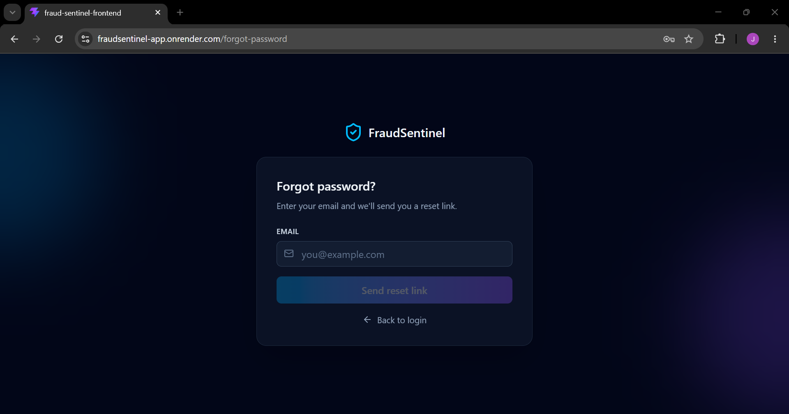 |

### Multi-factor authentication
| MFA challenge | MFA setup QR | Backup codes |
|---------------|--------------|--------------|
| 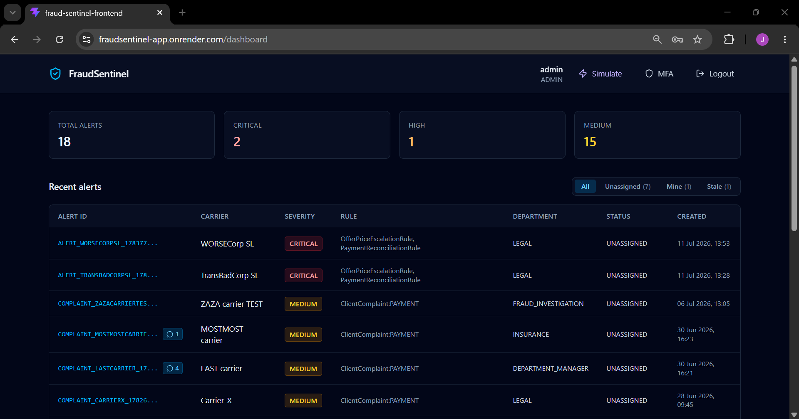 | 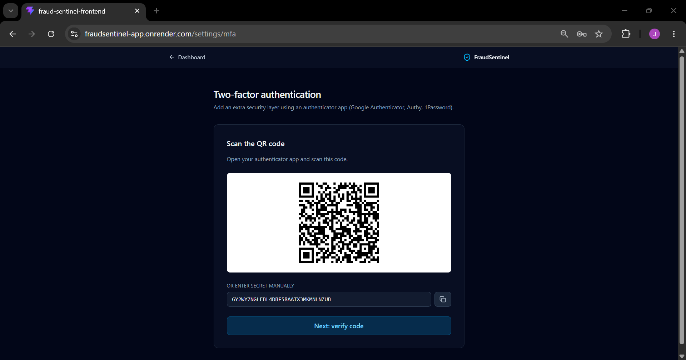 | 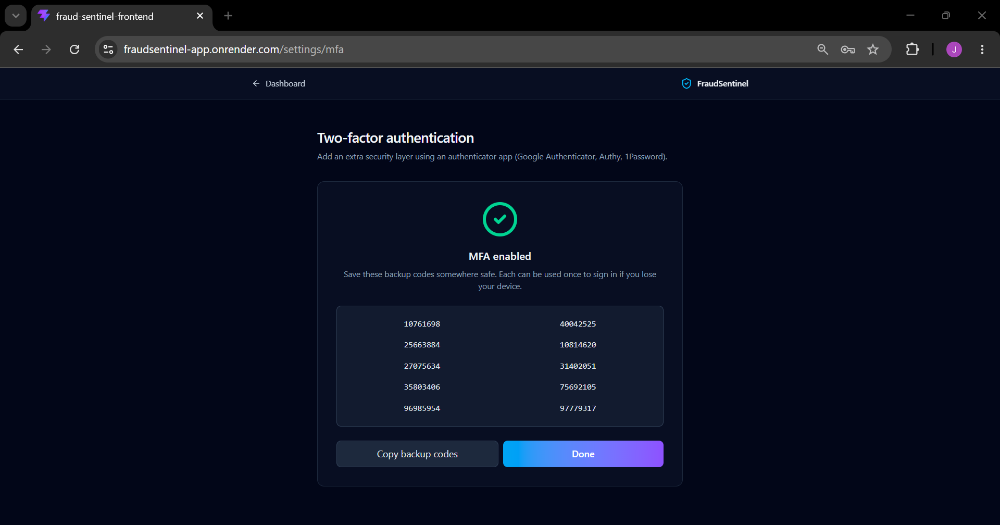 |

### Dashboard and case management
| Dashboard (stat cards + two-party columns + bulk actions) | Alert detail with timeline |
|-----------------------------------------------------|----------------------------|
| 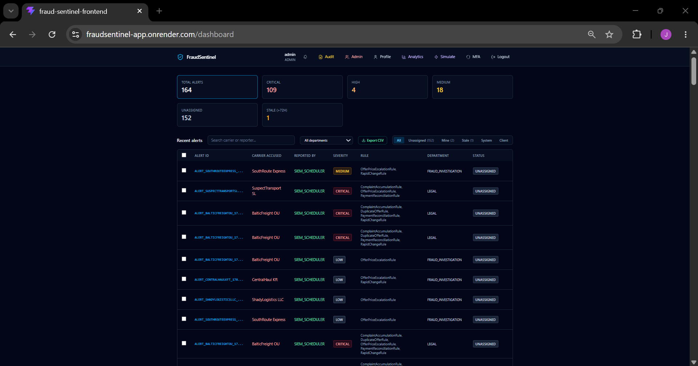 | 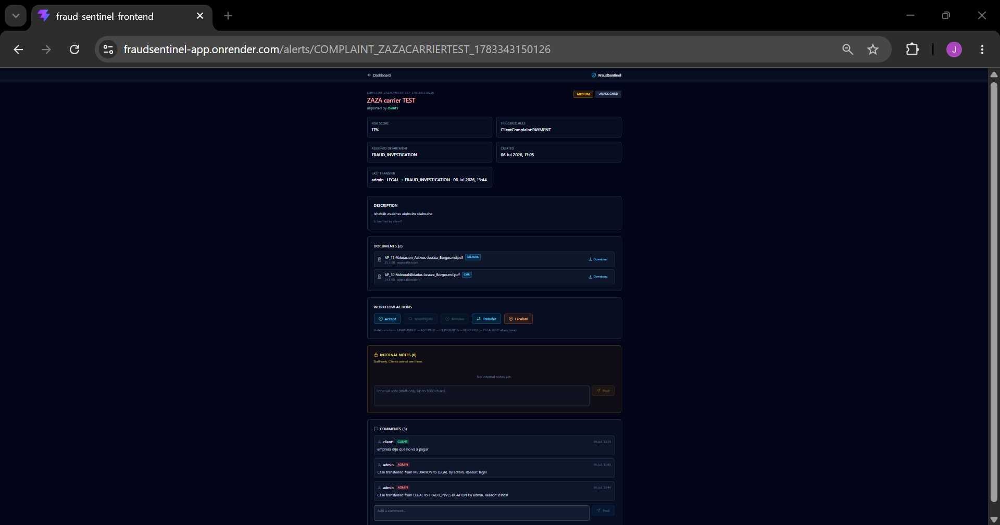 |

### Rule engine playground and analytics
| Simulate | Analytics |
|----------|-----------|
| 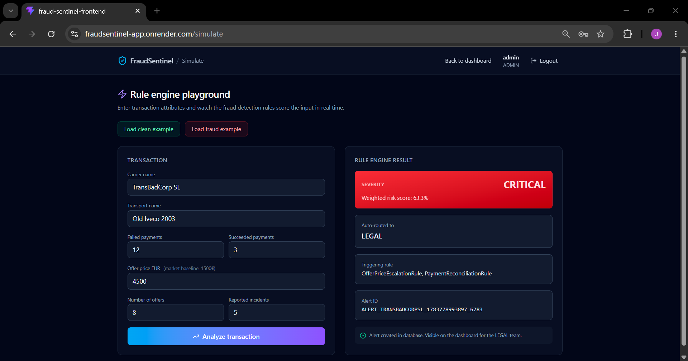 | 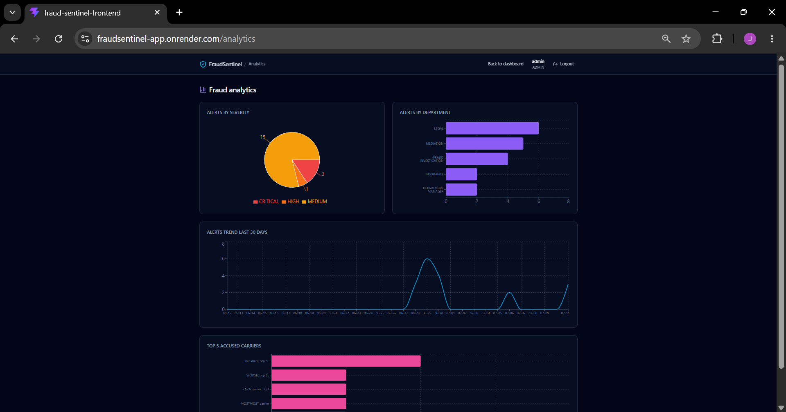 |

### Client experience
| Client complaints | Upload additional documents |
|-------------------|------------------------------|
| 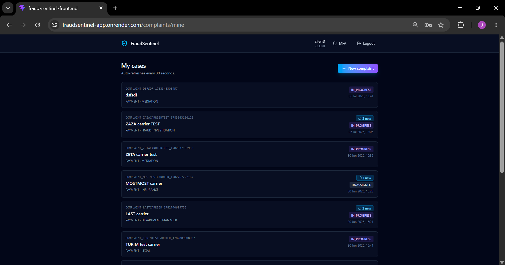 | 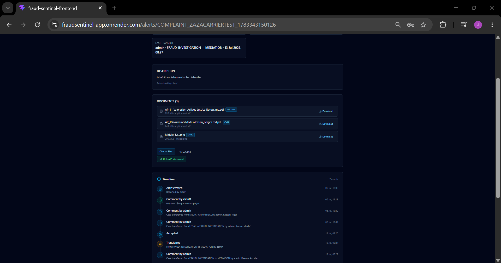 |

### API documentation and CI/CD
| Swagger UI (10 tags) | GitHub Actions |
|------------|----------------|
| 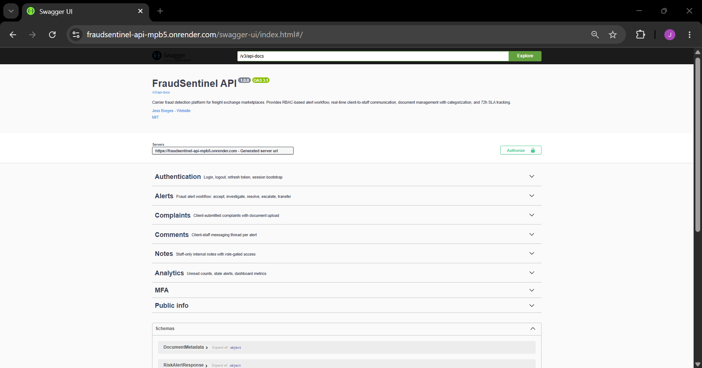 | 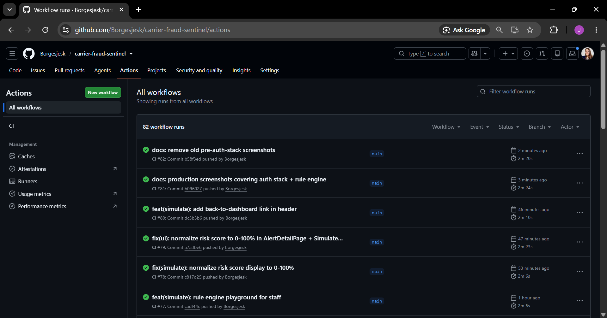 |

### Project management
| Project board | Alert timeline |
|---------------|-----------|
| 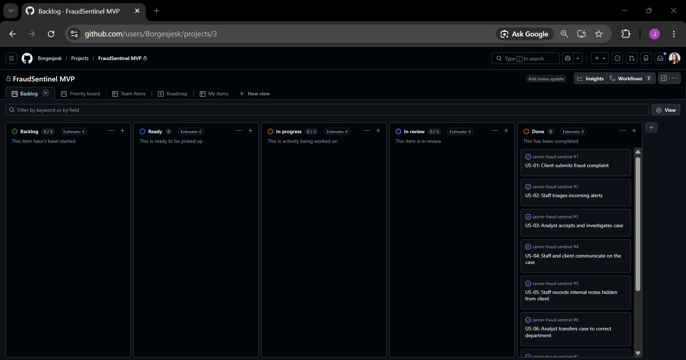 | 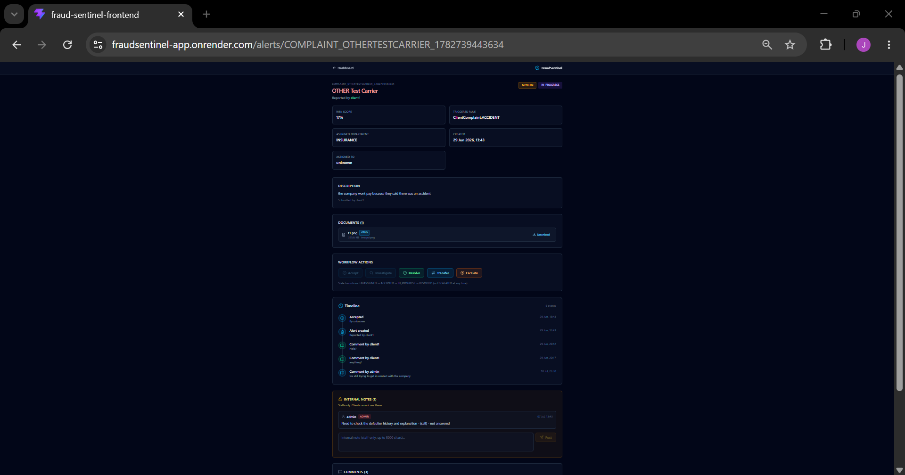 |

### Self-service, admin recovery, and observability
| Profile page | Admin user management | Session management | Audit log |
|--------------|------------------------|--------------------|-----------|
| 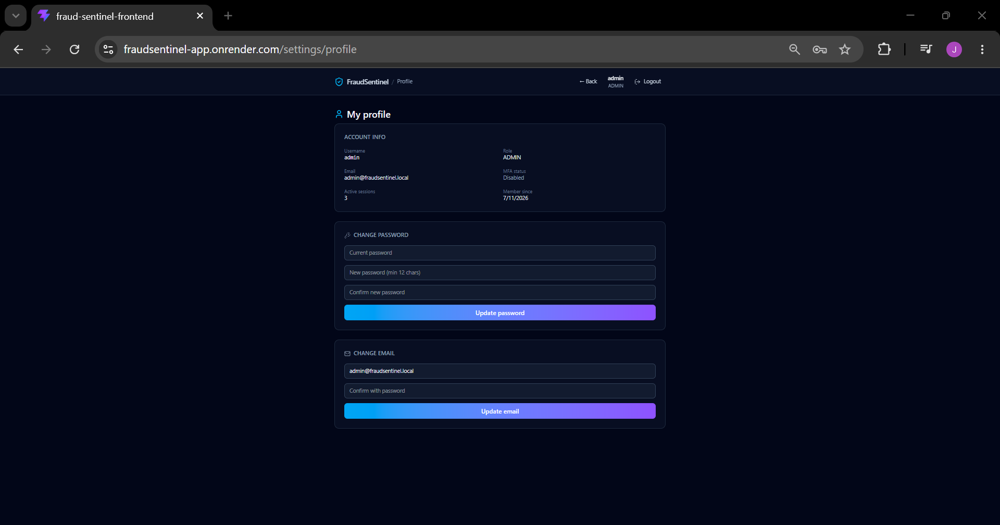 | 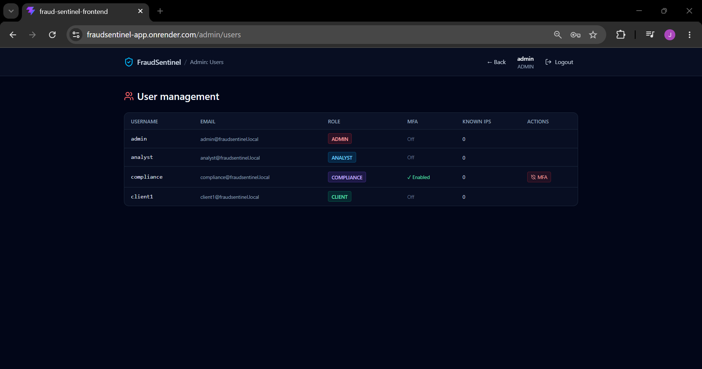 | 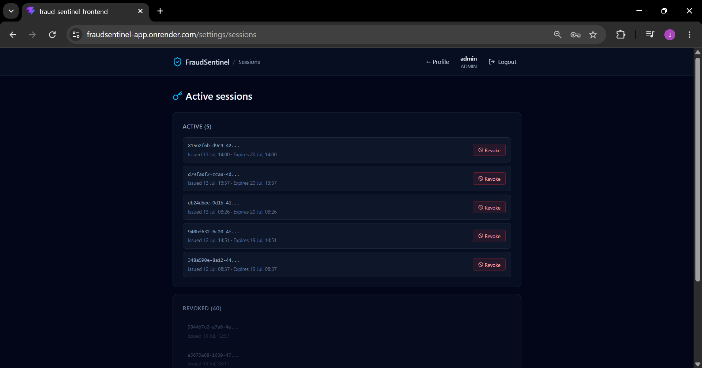 | 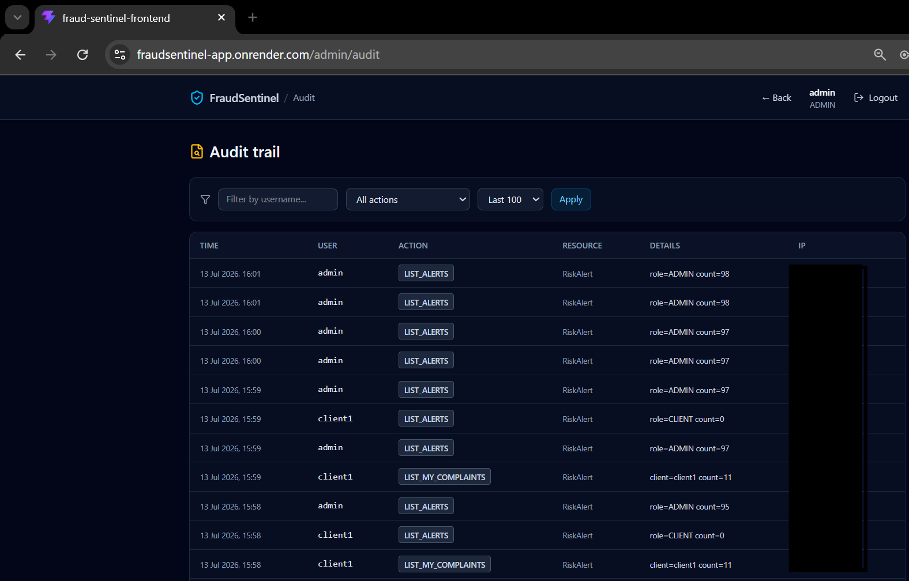 |

---

## 🎯 What it does

FraudSentinel scores carrier transactions in real time through a rule engine, generates alerts with calculated severity, and routes them to the responsible department automatically. From the moment a case enters the system — whether triggered by detection rules, injected by the auto-generator, or submitted by a client — it follows a tracked lifecycle: routed, claimed, investigated, resolved, or escalated, with full audit trail, bidirectional communication, and time-stamped events.

Two distinct user flows:

**Internal staff** (Admin, Analyst, Compliance) see alerts filtered by their role's visible departments. They can claim a case, investigate it, resolve it, escalate, transfer to another department, or perform bulk actions on multiple alerts at once. Every case has a comment thread where staff and the affected client can communicate. Staff can also run the rule engine manually via the Simulate page, view detailed analytics dashboards, export filtered alert lists to CSV, review the audit trail, and (for admins) manage users, sessions, and recovery scenarios.

**External clients** (carriers submitting complaints) log in to a separate flow. They cannot see other carriers' cases or internal notes. They submit a complaint with a description and supporting documents (PDF or images), then track the status of their case, add more documents to the case as the investigation unfolds, and respond to investigator questions through the comment thread.

**SIEM auto-generator** — a background scheduler picks a random carrier from a curated list every 60 seconds, generates a synthetic transaction (60% clean, 40% suspicious), runs the fraud detection rule engine, and creates alerts that pass the threshold. The dashboard fills continuously, so reviewers can watch the platform score real traffic patterns without waiting for manual input.

---

## 💡 Why it exists

I spent six years at a European carrier matching platform, investigating fraud, KYC, and AML compliance for European carriers. The patterns this system detects — payment reconciliation gaps, price escalation, complaint accumulation — are the exact patterns I worked with daily.

The detection rules and department routing reflect how real freight fraud investigation actually works. The CLIENT role exists because carriers need a way to submit cases without staff manually entering them. The comment thread exists because investigation is conversation, not just status updates. The audit log exists because compliance auditors ask "who did what when" and expect an answer.

This is a portfolio project, but it's not generic. It's the system I wished existed.

---

## 🛠️ Tech stack

**Backend**
- Java 21 (Eclipse Temurin)
- Spring Boot 3.5.14 (LTS)
- MongoDB Atlas (replica set, eu-west-3)
- Spring Security with JWT (HS256), BCrypt password hashing
- HttpOnly + Secure + SameSite=Lax cookie authentication
- Bucket4j for rate limiting
- googleauth for TOTP-based MFA
- Spring @Scheduled for the SIEM auto-generator
- Multipart file upload with disk-based storage (Strategy pattern, swap-ready for S3)
- RFC 7807 Problem Details for all error responses
- Springdoc OpenAPI 2.8.4 for Swagger UI

**Frontend**
- React 19 with TypeScript 5 (strict mode)
- Vite 8
- Tailwind CSS v4 (dark mode by default)
- React Router 7 with role-based protected routes
- Axios with silent auto-refresh interceptor
- qrcode.react for inline MFA QR generation
- Recharts for analytics visualization
- Lucide React for icons

**DevSecOps**
- OWASP Dependency-Check (fails build on CVSS >= 7.0)
- SpotBugs + FindSecBugs for static analysis
- JaCoCo coverage gate
- CycloneDX SBOM generation
- GitHub Actions CI/CD (backend + frontend + Docker build)
- Deployed on Render with same-origin proxy (mobile-friendly cookies)

---

## 🔐 Auth stack

The auth layer went deep because carrier fraud investigation is where credentials matter most.

- **HttpOnly cookie JWT** — token invisible to JavaScript; XSS payloads that try `document.cookie` or `localStorage.getItem('token')` find nothing
- **Access token 1h + refresh token 7d** — short blast radius on token theft; refresh persisted in MongoDB so it can be revoked instantly
- **Refresh token rotation with theft detection** — every refresh issues a new token and revokes the old one; reusing a revoked token triggers revocation of ALL of the user's refresh tokens
- **TOTP-based MFA** — enrollment via inline QR code + 10 backup codes; login flow: password → MFA challenge → session
- **TOTP re-authentication for sensitive changes** — password change, email change, and MFA disable all require a fresh 6-digit code if the user has MFA enabled; login session alone is not sufficient
- **IP allowlisting** — every successful login records the client IP address; profile mutation requests from unrecognized IPs are rejected with 403 Forbidden. Users are effectively locked to their known devices for account changes
- **Rate limiting** — Bucket4j token buckets, 5 login attempts/min and 60 general requests/min per IP; 429 responses in RFC 7807 format
- **Password reset with time-limited tokens** — 15-minute TTL, silent-fail on unknown email (prevents user enumeration)
- **RBAC enforced server-side** — the backend queries only the alerts each role should see; the frontend never receives forbidden data
- **Path traversal protection** — file storage resolves paths and verifies containment inside the storage root; filenames use UUIDs
- **Session management** — users see every active refresh token and revoke sessions individually from `/settings/sessions`
- **Audit log** — every meaningful action (login, password change, MFA event, alert transition, admin action) is recorded with username, action, resource, details, IP, and timestamp

**Role-based capabilities for profile changes**

| Role | Password | Email | Disable MFA | Bulk actions | Audit log | Admin controls |
|------|----------|-------|-------------|--------------|-----------|----------------|
| CLIENT | ✓ (with IP+TOTP) | ✓ (with IP+TOTP) | ✗ | ✗ | ✗ | ✗ |
| ANALYST | ✓ (with IP+TOTP) | ✗ (contact admin) | ✗ (contact admin) | ✓ | ✗ | ✗ |
| COMPLIANCE | ✓ (with IP+TOTP) | ✗ (contact admin) | ✗ (contact admin) | ✓ | ✓ | ✗ |
| ADMIN | ✓ (with IP+TOTP) | ✓ (with IP+TOTP) | ✓ (with IP+TOTP) | ✓ | ✓ | ✓ |

The email/MFA restrictions on staff (least privilege) prevent an insider from silently pivoting an account. The admin recovery endpoints exist for the real-world case of a user losing their MFA device or moving locations. All actions are audit-logged.

---

## 🎲 Detection rules

Three rules implemented with the Strategy pattern. Adding a new rule is a new class implementing the same interface, no changes to the dispatcher.

| Rule | Triggers on | Severity logic | Routes to |
|------|-------------|----------------|-----------|
| PaymentReconciliationRule | High unpaid invoice ratio | 0.0 to 1.0 by percent unpaid | MEDIATION |
| OfferPriceEscalationRule | Offer price more than 50% above baseline | 0.0 to 1.0 by deviation | FRAUD_INVESTIGATION |
| ComplaintAccumulationRule | Multiple complaint categories accumulating | 0.0 to 1.0 by incident weight | LEGAL or INSURANCE |

Domain validation rejects impossible inputs at the boundary — for example, 25 incidents on 2 offers returns 422 with an RFC 7807 problem document.

Staff can run the rule engine interactively via the Simulate page, or watch it work continuously via the auto-generator (60% clean traffic, 40% suspicious profiles, one transaction per minute).

---

## 👥 Role-based access control

| Role | Visible departments | Real-world use case |
|------|---------------------|---------------------|
| ADMIN | All 11 | Platform administrator with recovery powers |
| COMPLIANCE | LEGAL, COMPLIANCE_REVIEW, DEPARTMENT_MANAGER | Regulatory review, audit log access |
| ANALYST | MEDIATION, FRAUD_INVESTIGATION, INSURANCE, CUSTOMER_SERVICE | Day-to-day investigation work |
| CLIENT | None (own cases only) | External carrier submitting a complaint |

CLIENT is fundamentally different from the others — they don't have departmental visibility. They access only their own submitted complaints, the documents they attached, and the comment thread on those cases. Authorization for CLIENT is enforced at the controller by comparing `authentication.getName()` against the alert's `createdBy` field.

---

## 📋 Dashboard features

- **Six clickable stat cards** — total, critical, high, medium, unassigned, stale. Clicking a card applies the matching filter
- **Search bar** — case-insensitive substring match against carrier or complainant
- **Filter tabs** — all, unassigned, mine, stale
- **Department filter dropdown** — narrow to a single team
- **Two-party columns** — accused carrier in red, complainant in emerald
- **Color-coded status badges** — slate/sky/violet/emerald/red per state
- **Bulk selection** — checkbox on each row, floating action bar with Accept and Resolve for the selection
- **CSV export** — download the currently filtered list with all metadata
- **Notification bell** — polls every 30s, refreshes immediately when an alert is opened, dropdown shows the 10 most recent unread threads
- **Live audit trail** — every alert has a chronological timeline showing creation, assignment, transfer, comments, and resolution
- **Source separation tabs** — filter by System (auto-generated by SIEM) or Client (submitted through complaints) to focus on the traffic that matters right now

---

## 📊 Analytics dashboard

Four Recharts visualizations available at `/analytics`:

- Alerts by severity (donut chart with color scheme matching the rest of the UI)
- Alerts by department (horizontal bar chart, sorted by count)
- 30-day trend of alerts created per day (line chart)
- Top 5 most-accused carriers (horizontal bar chart)

---

## 🏗️ Architecture

```
src/main/java/com/carrierfraud/
├── domain/          Entities, enums, value objects, business rules
├── application/     Services, use cases, detection rules (Strategy pattern), SIEM scheduler
├── infrastructure/  MongoDB repositories + disk storage implementation
├── api/             REST controllers, DTOs, exception handlers, profile management
├── security/        Spring Security config, JWT, MFA, password reset, refresh tokens
├── audit/           Tamper-resistant audit log with query controller
└── config/          Cookie, CORS, MongoDB index configuration

frontend/
├── src/types/       TypeScript interfaces matching backend DTOs
├── src/api/         Axios client + service modules
├── src/auth/        AuthContext with three-state session machine
├── src/components/  Reusable components (Timeline, NotificationBell, CommentsThread, ProtectedRoute)
└── src/pages/       Login, Dashboard, AlertDetail, Analytics, Simulate, Profile, Sessions,
                     AdminUsers, AuditLog, MfaSetup, ...
```

---

## 🔗 Key endpoints

**Authentication and account**
- `POST /api/v1/auth/login` — issues HttpOnly cookie or returns `{mfaRequired: true}`
- `POST /api/v1/auth/login/mfa` — completes MFA challenge
- `POST /api/v1/auth/refresh` — silent access-token refresh (called automatically on 401)
- `POST /api/v1/auth/forgot-password` / `/reset-password` — password recovery
- `POST /api/v1/auth/mfa/setup` + `/verify-setup` — enroll TOTP with backup codes
- `GET /api/v1/auth/me` — session bootstrap
- `POST /api/v1/auth/logout` — clears cookies, revokes refresh token

**Profile (self-service, requires known IP + TOTP if MFA enabled)**
- `GET /api/v1/profile` — full profile including active sessions and backup codes remaining
- `PUT /api/v1/profile/password` — change password
- `PUT /api/v1/profile/email` — change email (CLIENT and ADMIN only)
- `POST /api/v1/profile/mfa/disable` — disable MFA (ADMIN only)
- `GET /api/v1/profile/sessions` — list your active refresh tokens
- `POST /api/v1/profile/sessions/{tokenId}/revoke` — revoke a specific session

**Admin recovery (ADMIN only)**
- `GET /api/v1/profile/admin/users` — list every user with MFA and IP status
- `POST /api/v1/profile/admin/users/{username}/mfa/disable` — recover locked-out user
- `POST /api/v1/profile/admin/users/{username}/reset-ips` — clear IP allowlist after user changes location

**Audit (ADMIN + COMPLIANCE)**
- `GET /api/v1/audit/logs` — chronological audit trail with filters by username and action

**Alerts (staff)**
- `GET /api/v1/transactions/alerts` — list filtered by role
- `GET /api/v1/transactions/alerts/{id}` — single alert with RBAC check
- `PUT /api/v1/transactions/alerts/{id}/accept|investigate|resolve|escalate|transfer` — workflow actions
- `POST /api/v1/transactions/analyze` — run rule engine on a transaction (used by Simulate)

**Complaints (client)**
- `POST /api/v1/complaints` — multipart submission with description and documents
- `GET /api/v1/complaints/mine` — own cases ordered by date desc
- `POST /api/v1/complaints/{id}/documents` — add more documents to your own complaint
- `GET /api/v1/complaints/{id}/documents/{docId}` — secure download

**Communication**
- `GET|POST /api/v1/alerts/{id}/comments` — comment thread
- `GET|POST /api/v1/alerts/{id}/notes` — internal notes (staff-only)
- `GET /api/v1/alerts/unread-counts` — unread badge counts
- `POST /api/v1/alerts/{id}/read` — mark as read

**Public**
- `GET /api/v1/info/features` — anonymous version + feature list

---

## 🚀 Running locally

### Quick start with Docker (recommended)

```bash
git clone https://github.com/Borgesjesk/carrier-fraud-sentinel
cd carrier-fraud-sentinel
docker compose up -d
```

Backend on http://localhost:8080, Swagger UI at /swagger-ui.html. Four demo users are seeded automatically: `admin`, `analyst`, `compliance`, `client1`. Default passwords are in `docker-compose.yml` — override via `.env` for non-local use.

The SIEM auto-generator kicks in immediately and creates alerts every 60 seconds. Disable via `APP_ALERT_GENERATOR_ENABLED=false` if you want a quiet dashboard.

### Manual setup

**Prerequisites**
- Java 21 or newer
- Node 20 or newer
- MongoDB Atlas connection string (free tier works)

**Backend**
```bash
cp env.example .env
# Edit .env with your MONGODB_URI, JWT_SECRET, seed passwords
set -a; source .env; set +a
./mvnw spring-boot:run
```

**Frontend**
```bash
cd frontend
npm install
npm run dev
```

Frontend on http://localhost:5173. Expects `VITE_API_BASE_URL=http://localhost:8080` in `frontend/.env.local`.

---

## 🧪 Testing

```bash
./mvnw test                                  # 139+ unit + integration tests
./mvnw verify -P security                    # full DevSecOps pipeline
./mvnw org.cyclonedx:cyclonedx-maven-plugin:makeAggregateBom  # SBOM
```

---

## 👋 About me

I'm Jess Borges — Spanish-Brazilian, six years in fraud investigation and AML compliance at a European freight exchange, now transitioning into cybersecurity through the Ironhack IFCT0109 program. My goal is SOC Analyst then DevSecOps.

This project sits at the intersection of where I came from and where I'm going.

---

## 📄 License

MIT