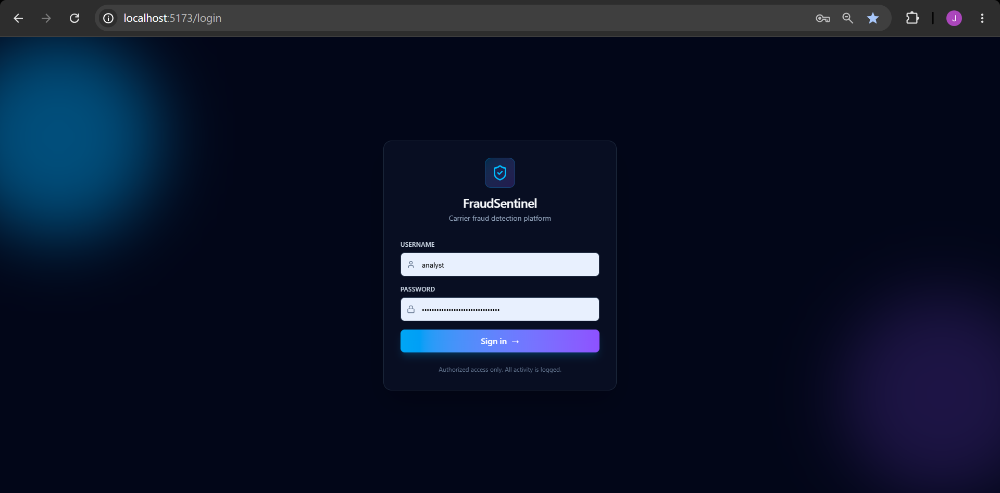
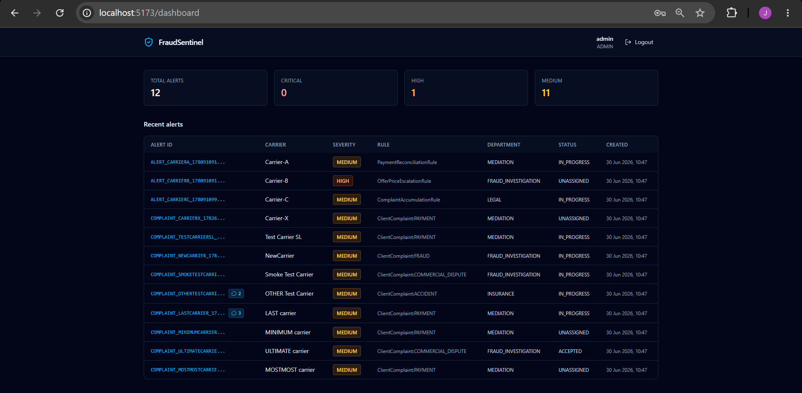
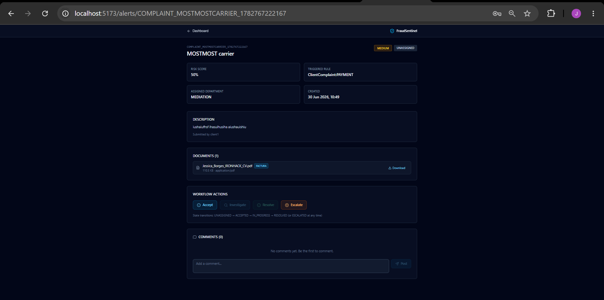
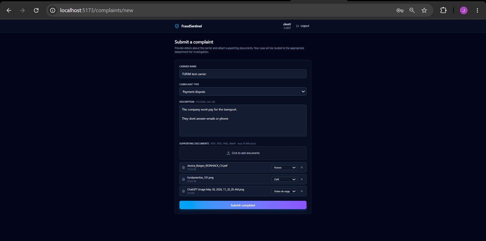
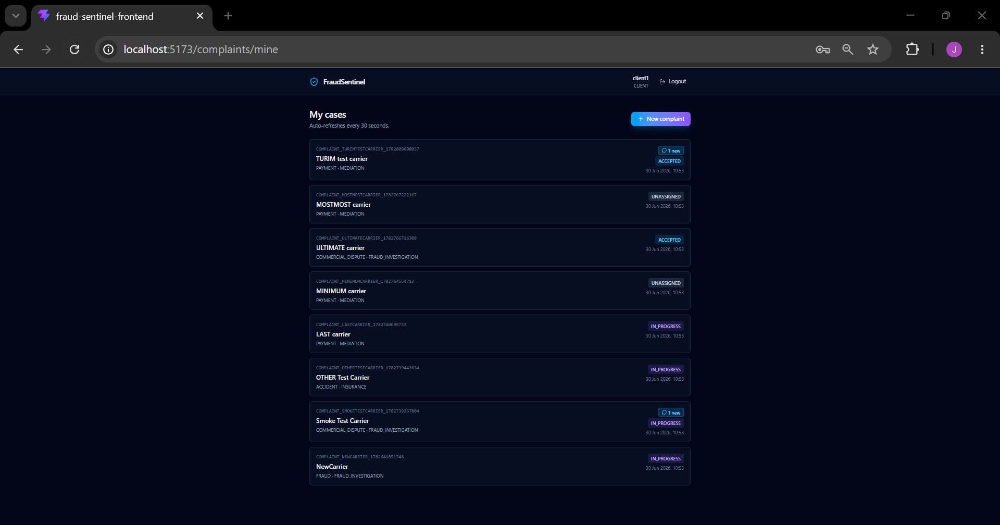
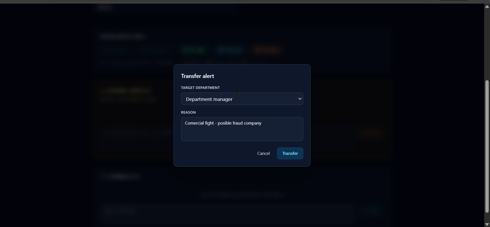
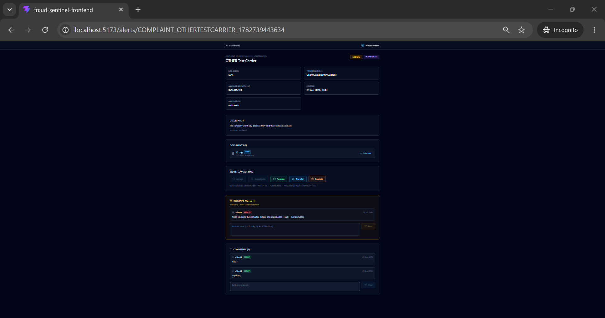
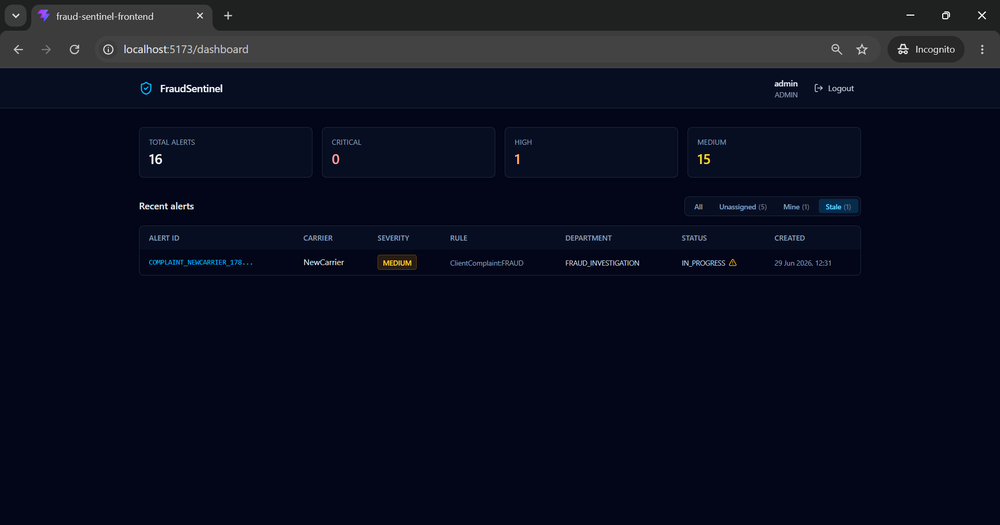

# FraudSentinel


[](https://github.com/Borgesjesk/carrier-fraud-sentinel/actions/workflows/ci.yml)

A carrier fraud detection platform with role-based access control, multi-channel case management, and real-time alert routing.

Built as the final project for the IT Academy Barcelona Java Backend bootcamp. The design comes directly from six years of fraud investigation work at a European freight exchange, where I dealt daily with the patterns this system detects: carriers gaming payment terms, escalating offer prices, and accumulating complaints across multiple categories.


## Screenshots

### Login


### Staff dashboard (RBAC-filtered alerts)


### Alert detail with workflow, documents, and comments


### Client complaint form (with document categories)


### Client case list with unread notifications


### Transfer alert modal (staff can reroute cases between departments)


### Internal notes (staff-only, invisible to clients)


### Stale alert detection (72h without activity)


### Transfer alert modal (staff can reroute cases between departments)

### Internal notes (staff-only, invisible to clients)

### Stale alert detection (72h without activity)

---

## What it does

FraudSentinel scores carrier transactions in real time, generates alerts with calculated severity, and routes them to the responsible department automatically. From the moment a case enters the system — whether triggered by detection rules or submitted by a client — it follows a tracked lifecycle: routed, claimed, investigated, resolved or escalated, with full audit trail and bidirectional communication.

There are two distinct user flows:

**Internal staff** (Admin, Analyst, Compliance) see the alerts that fall under their role's visible departments. They can claim a case, investigate it, resolve it with a written summary, or escalate to another team. Every case has a comment thread where staff and the affected client can communicate.

**External clients** (carriers submitting complaints) log in to a separate flow. They cannot see other carriers' cases or internal alerts. They submit a complaint with a description and supporting documents (PDF or images), then track the status of their case and respond to investigator questions through the same comment thread.

---

## Why it exists

I spent six years at a European carrier matching platform, investigating fraud, KYC, and AML compliance for European carriers. The patterns this system detects — payment reconciliation gaps, price escalation, complaint accumulation — are the exact patterns I worked with daily.

The detection rules and department routing reflect how real freight fraud investigation actually works. The CLIENT role exists because carriers need a way to submit cases without staff manually entering them. The comment thread exists because investigation is conversation, not just status updates.

This is a portfolio project, but it's not generic. It's the system I wished existed.

---

## Tech stack

**Backend**
- Java 21 (Eclipse Temurin)
- Spring Boot 3.5.14 (LTS)
- MongoDB Atlas (replica set, eu-west-3)
- Spring Security with JWT signed HS384
- BCrypt password hashing, strength 12
- HttpOnly + Secure + SameSite=Strict cookie authentication
- Multipart file upload with disk-based storage (Strategy pattern, ready to swap for S3 or MinIO)
- RFC 7807 Problem Details for all error responses

**Frontend**
- React 19 with TypeScript 5
- Vite 8
- Tailwind CSS v4 (utility-first, dark mode by default)
- React Router 7 with role-based protected routes
- Axios configured with `withCredentials` so the HttpOnly cookie travels automatically
- Lucide React for icons

**DevSecOps**
- OWASP Dependency-Check (fails build on CVSS ≥ 7.0)
- SpotBugs + FindSecBugs for static analysis
- JaCoCo with a 50 percent line coverage gate (ratcheting toward 80)
- CycloneDX 1.5 SBOM
- Maven Enforcer rules for Java 21+ and Maven 3.9+
- GitHub Actions CI on every push

---

## Security choices

Most of the security decisions in this project were deliberate, not accidental. A few I want to call out:

**JWT lives in an HttpOnly cookie, not localStorage.** This means JavaScript cannot read the token. You can verify this in DevTools: while authenticated, `document.cookie` returns an empty string. An XSS payload that tries `localStorage.getItem('token')` finds nothing because there's nothing to find. The cookie still travels on every request because the browser sends it automatically with `Cookie:` header. This is structural protection, not defensive coding.

**SameSite=Strict on the cookie** mitigates CSRF without needing a separate CSRF token mechanism. Combined with same-origin policy, cross-site requests cannot carry the session cookie.

**RBAC is enforced server-side, not in the UI.** When an analyst loads the dashboard, the backend queries only the alerts in their visible departments. The frontend doesn't know other alerts exist. An attacker opening DevTools cannot reveal alerts they shouldn't see, because the backend never sent them in the first place.

**Path traversal protection in file storage.** Every read, write, and delete operation in `DiskDocumentStorage` resolves the path and verifies it starts with the configured storage root. Filenames use UUIDs, never user-supplied strings.

**Secrets are externalized.** The JWT signing key, MongoDB credentials, cookie security flags, and seed user passwords all come from environment variables. The repo has `env.example` showing what's needed; the actual `.env` is gitignored.

**23 CVEs patched.** Spring Boot's own dependency BOM lags behind upstream fixes for Tomcat and Log4j. I overrode both to current secure versions (Tomcat 10.1.55, Log4j 2.25.4).

---

## Architecture

```
src/main/java/com/carrierfraud/
├── domain/          Entities, enums, value objects, business rules
├── application/     Services, use cases, detection rules (Strategy pattern)
├── infrastructure/  MongoDB repositories + disk storage implementation
├── api/             REST controllers, DTOs, exception handlers
├── security/        Spring Security config, JWT, filter chain, auth controller
├── audit/           Tamper-resistant audit log
└── config/          Cookie, CORS, MongoDB index configuration

frontend/
├── src/types/       TypeScript interfaces matching backend DTOs
├── src/api/         Axios client + service modules
├── src/auth/        AuthContext with three-state session machine
├── src/components/  Reusable components (ProtectedRoute, CommentsThread)
└── src/pages/       Login, Dashboard, AlertDetail, ClientComplaint, MyComplaints
```

---

### Refresh tokens with revocation

Access JWT expires in 1 hour (short blast radius on token theft). Refresh
token is stored in MongoDB with a 7-day TTL and can be revoked instantly
via the logout endpoint. Frontend axios interceptor auto-refreshes on any
401, retries the original request transparently. User keeps working;
attacker gets 1 hour max.

### Rate limiting

Bucket4j token buckets keyed by IP:
- POST /api/v1/auth/login: 5 attempts per minute (brute force defense)
- All other endpoints: 60 requests per minute per client

429 responses follow RFC 7807 Problem Details. Reset window is 60 seconds.

### Interactive API documentation

Swagger UI live at /swagger-ui.html. All 20+ endpoints organized by tag
(Authentication, Alerts, Complaints, Comments, Notes, Analytics). Reviewers
can explore the contract and try requests without cloning the repo.

## Detection rules

Three rules implemented with the Strategy pattern. Open for extension, closed for modification — adding a new rule is a new class implementing the same interface, no changes to the dispatcher.

| Rule | Triggers on | Severity logic | Routes to |
|------|-------------|----------------|-----------|
| PaymentReconciliationRule | High unpaid invoice ratio | 0.0 to 1.0 by percent unpaid | MEDIATION |
| OfferPriceEscalationRule | Offer price more than 50% above baseline | 0.0 to 1.0 by deviation | FRAUD_INVESTIGATION |
| ComplaintAccumulationRule | Multiple complaint categories accumulating | 0.0 to 1.0 by incident weight | LEGAL or INSURANCE |

Domain validation rejects impossible inputs at the boundary — for example, 25 incidents on 2 offers returns 422 with an RFC 7807 problem document, not a silent miscalculation.

---

## Role-based access control

| Role | Visible departments | Real-world use case |
|------|---------------------|---------------------|
| ADMIN | All 11 | Platform administrator |
| COMPLIANCE | LEGAL, COMPLIANCE_REVIEW, DEPARTMENT_MANAGER | Regulatory review and oversight |
| ANALYST | MEDIATION, FRAUD_INVESTIGATION, INSURANCE, CUSTOMER_SERVICE | Day-to-day investigation work |
| CLIENT | None (own cases only) | External carrier submitting a complaint |

CLIENT is fundamentally different from the others — they don't have departmental visibility at all. They access only their own submitted complaints, the documents they attached, and the comment thread on those cases. The authorization checks for CLIENT happen at the controller level, comparing `authentication.getName()` against the alert's `createdBy` field.

---

## Key endpoints

**Authentication**
- `POST /api/v1/auth/login` — issues HttpOnly cookie, returns `{username, role}`
- `GET /api/v1/auth/me` — session bootstrap on page refresh
- `POST /api/v1/auth/logout` — clears cookie

**Alerts (staff)**
- `GET /api/v1/transactions/alerts` — list filtered by role
- `GET /api/v1/transactions/alerts/{id}` — single alert with RBAC check
- `PUT /api/v1/transactions/alerts/{id}/{action}` — workflow actions: accept, investigate, resolve, escalate

**Complaints (client)**
- `POST /api/v1/complaints` — multipart submission with description and documents
- `GET /api/v1/complaints/mine` — own cases, ordered by creation date desc
- `GET /api/v1/complaints/{id}/documents/{docId}` — secure document download with original filename preserved

**Comments**
- `GET /api/v1/alerts/{id}/comments` — chronological thread
- `POST /api/v1/alerts/{id}/comments` — add comment

**Notifications**
- `GET /api/v1/alerts/unread-counts` — map of alertId → unread comment count for the current user
- `POST /api/v1/alerts/{id}/read` — mark alert as read (fires when AlertDetail opens)

---

## Running locally

**Prerequisites**
- Java 21 or newer
- Node 20 or newer
- MongoDB Atlas connection string (free tier works)

**Backend**

```bash
cp env.example .env
# Edit .env with your MONGODB_URI, JWT_SECRET, seed passwords, cookie settings
set -a; source .env; set +a
./mvnw spring-boot:run
```

The backend runs on http://localhost:8080.

**Frontend**

```bash
cd frontend
npm install
npm run dev
```

The frontend runs on http://localhost:5173. It expects `VITE_API_BASE_URL=http://localhost:8080` in `frontend/.env.local`.

**Demo users**

The dev profile seeds four users on first startup using passwords from environment variables (`SEED_ADMIN_PASSWORD`, `SEED_ANALYST_PASSWORD`, `SEED_COMPLIANCE_PASSWORD`, `SEED_CLIENT_PASSWORD`):

- `admin` — ADMIN role
- `analyst` — ANALYST role
- `compliance` — COMPLIANCE role
- `client1` — CLIENT role

---

## Testing

```bash
./mvnw test                                  # unit + integration tests
./mvnw verify -P security                    # full DevSecOps pipeline
./mvnw org.cyclonedx:cyclonedx-maven-plugin:makeAggregateBom  # generate SBOM
```

Coverage gate is currently 50 percent on the `application` and `domain` packages, ratcheting toward 80.

---

## What's next

Implemented as the bootcamp deliverable, but realistic next steps if I keep building:

- WebSocket or SSE for real-time push notifications (currently 30-second polling on the client case list)
- Alert reassignment between departments with audit trail
- Status change timeline on the AlertDetail page
- E2E tests with Playwright
- Production deployment via Docker Compose (Dockerfile already in repo)
- Migrate document storage from local disk to S3 or MinIO (the `DocumentStorage` interface is already set up for this)

---

## About me

I'm Jess Borges — Spanish-Brazilian, six years in fraud investigation and AML compliance at a European freight exchange, now transitioning into cybersecurity through the Ironhack IFCT0109 program. My goal is SOC Analyst then DevSecOps.

This project sits at the intersection of where I came from and where I'm going.

---

## License

MIT